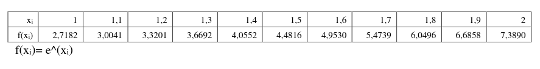
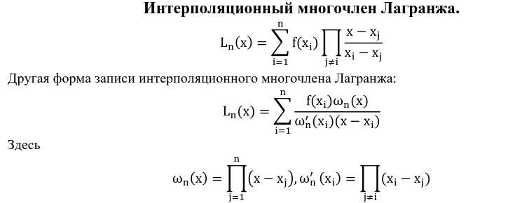
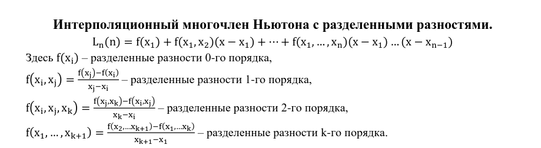
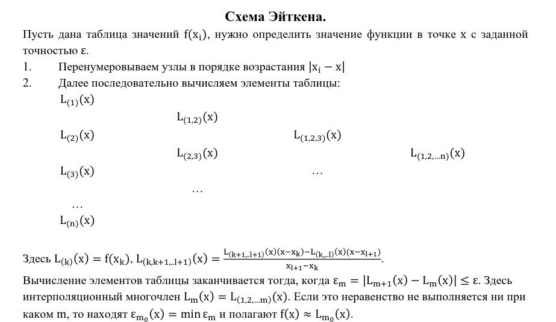

# Задание:

1. Написать программу нахождения значения функции в любой заданной точке из отрезка с
   помощью интерполяционной формулы Лагранжа.
2. Программно реализовать схему Эйткена, учесть возможность задания разных значений
   точности.
3. Сравнить результаты пунктов 1 и 2 на примере нахождения значения функции в точке x =
   1.43 с точностью ε = 10−3. Функция задана таблично
   

# Interpolation methods

  Интерполяционный многочлен Лагранжа
    

  Интерполяционный многочлен Ньютона с разделенными разностями.
    

  Схема Эйткена
    
