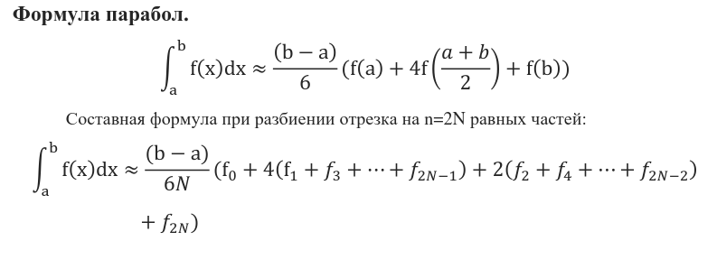

## Integration methods

      Rectangular Rule (Middle point)
      Trapezoid Rule
      Simpson Rule (Parabola) (look at the picture 'формула симпсона')

# Правило Рунге.

Интеграл вычисляется по выбранной формуле (прямоугольников, трапеций,
парабол) при числе шагов, равном n, а затем при числе шагов, равном 2n. Погрешность
вычисления значения интеграла при числе шагов, равном 2n, определяется по формуле
Рунге: ∆2𝑛≈ 𝜃|𝐼2𝑛 − 𝐼𝑛|, 𝜃 = 1/3 - для формул прямоугольников и трапеций, 𝜃 = 1/15 для
формулы парабол.

# Задание:

Выбрав одну из формул численного интегрирования, найти значения
интегралов (выбираете любой набор из 6 вариантов) с заданной точностью 𝜀 = 10−4.
Количество разбиений определяется по правилу Рунге. Вывести на экран значение
интеграла, количество разбиений, сравнить с решением, полученным в любом
математическом пакете.
